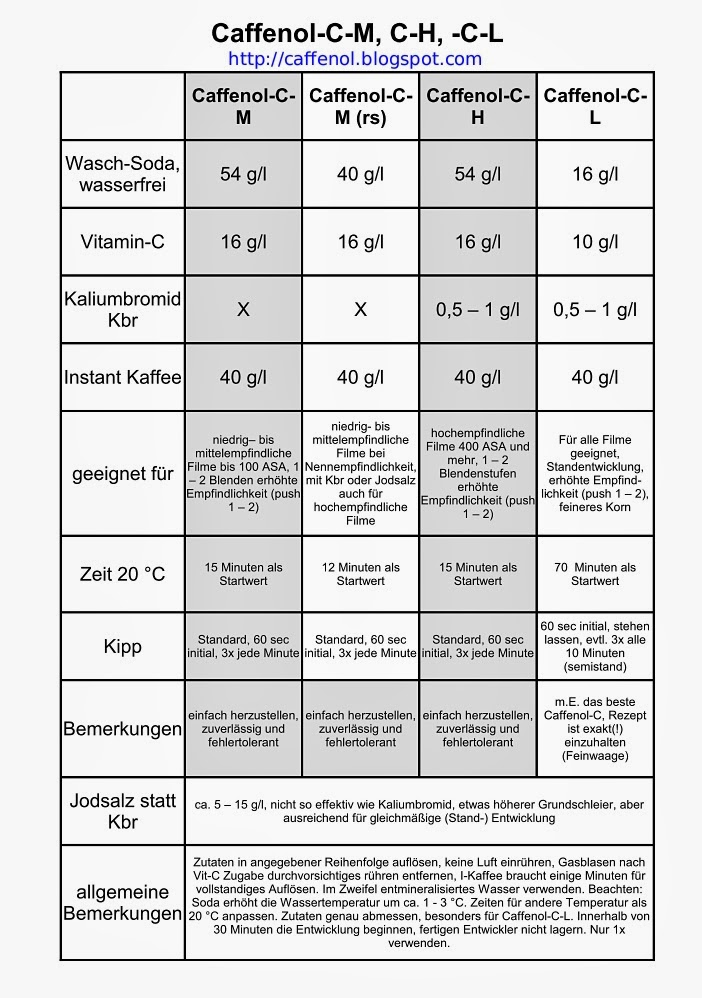

# Caffenol

## HP5
- 500ml destilliertes Wasser
- 27g Wasch-Soda
- 8g Vitamin-C
- 0.5g Kaliumbromid
- 20g Instant Kaffee

1. Zutaten in Reihenfolge auflösen: __jeweils warten bis alle Blasen verschwunden sind__
2. Achten auf Temperatur: __20°C__
3. Timer stellen: __15 Minuten__
4. Eingießen und die ersten __60 Sekunden__ kippen (2 Sekunden Rhythmus)
5. Danach jede Minute __3__ mal kippen (2 Sekunden Rhythmus)
6. Ausgießen
7. Drei mal mit Leitungswasser auffüllen und ausgießen
8. Fixer einfüllen: __ca 10 Minuten__ fixieren
9. Ausgießen
10. Wasser einfüllen: __5__ mal kippen
11: Ausgießen
12: Wasser einfüllen: __10__ mal kippen
13: Ausgießen
14: Wasser einfüllen: __20__ mal kippen
15. In destilliertes Wasser (mit ein weniger Wasserflow versehen) __5__ mal hoch und runter ziehen
